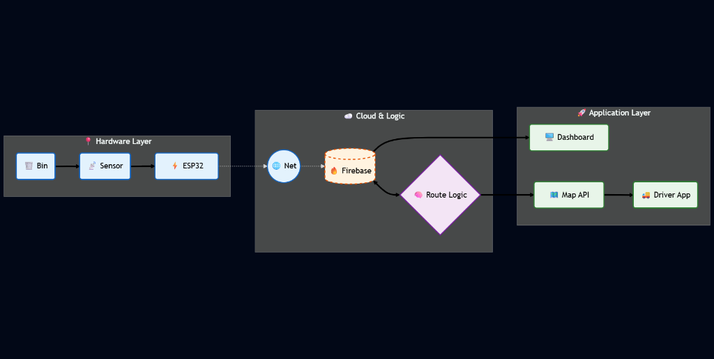

# Eco-Command | Municipal Waste Management System

**Eco-Command** is a smart, IoT-enabled dashboard for monitoring and managing municipal waste collection. It provides real-time tracking of waste collection fleets, monitors smart bin fill levels, and offers a multilingual interface for diverse municipal teams.

## 🚧 Problem Statement

Rapid urbanization has led to inefficient waste management systems characterized by:
*   **Overflowing Bins**: Leading to health hazards and poor sanitation.
*   **Inefficient Routing**: Collection trucks follow fixed routes regardless of bin fill levels, ensuring fuel and time wastage.
*   **Lack of Visibility**: Authorities have no real-time tracking of where trucks are or which bins are missed.
*   **Communication Gaps**: Language barriers between drivers and control centers often lead to operational delays.

## 🎯 Gaps We Covered

This project bridges key gaps in traditional waste management:
*   **Live Monitoring vs. Static Schedules**: Transitioned from fixed daily pickups to dynamic, data-driven dispatching based on real-time bin status.
*   **Predictive Operations**: Sensors alert the system *before* overflow occurs ("Warning" state), allowing proactive collection.
*   **Inclusive Technology**: Added **Multilingual Voice & UI Support** (8 Indian languages) so drivers of all linguistic backgrounds can use the system effectively.
*   **Gamification**: Introduced a **Leaderboard** to motivate drivers and track performance, addressing the lack of incentives in the sector.

## 🏗️ Architecture Design

The system connects IoT hardware (Smart Bins) with a Cloud Backend and a User-Facing Application Layer.



## 💻 User Interface

### 1. Global Command Dashboard
A centralized view for monitoring all trucks, route efficiency, and real-time alerts.


### 2. Inclusive Multilingual Support
To empower local drivers, the entire interface (including voice navigation) can be instantly toggled between **8 Indian languages** (Hindi, Marathi, Gujarati, etc.).


### 3. 🎙️ Voice Command System
The system features an integrated **Voice Assistant** that:
*   Announces critical alerts (e.g., "Bin 4 is Critical").
*   Confirms actions like "Dispatching Fleet".
*   Allows hands-free theme and language toggling for drivers on the go.

*   **📍 Live Fleet Tracking**: Real-time visualization of garbage collection trucks on an interactive map using Ola Maps & MapLibre GL.
*   **🗑️ Smart Bin Monitoring**: Live status of waste bins, categorizing them into 'Normal', 'Warning', and 'Critical' based on fill levels.
*   **🗣️ Multilingual Support**: Accessible in **8 languages** including English, Hindi, Marathi, Gujarati, Tamil, Telugu, Bengali, and Kannada.
*   **🎙️ Voice Assistance**: Built-in voice feedback for system alerts, theme changes, and navigation.
*   **🌓 Dark/Light Mode**: Toggle between themes for better visibility during day or night shifts.
*   **🏆 Leaderboard**: Gamification element to track and reward efficient collection drivers.
*   **📱 Responsive Design**: Fully optimized for desktops, tablets, and mobile devices.

## 🛠️ Tech Stack

*   **Frontend**: HTML5, CSS3, JavaScript (ES6+)
*   **Maps**: [Ola Maps API](https://maps.olacabs.com/), [MapLibre GL JS](https://maplibre.org/)
*   **Backend / Database**: [Firebase Realtime Database](https://firebase.google.com/)
*   **Icons**: [FontAwesome](https://fontawesome.com/)
*   **Fonts**: Inter, Space Grotesk (Google Fonts)

## 🚀 Getting Started

Follow these steps to set up the project locally.

### Prerequisites

*   A code editor (VS Code recommended)
*   A modern web browser
*   **Firebase Account**: scalable real-time Realtime Database.
*   **Ola Maps API Key**: for map tiles.

### Installation

1.  **Clone the repository:**
    ```bash
    git clone https://github.com/Shreyash-coder40/MUNICIPAL_PARTY_WASTE_SEGREGATION_WEBSITE.git
    cd MUNICIPAL_PARTY_WASTE_SEGREGATION_WEBSITE
    ```

2.  **Configure API Keys:**
    *   Open `script.js`.
    *   Replace the placeholder values in the `FIREBASE_CONFIG` object with your actual Firebase project credentials.
    *   Replace `OLA_API_KEY` with your valid Ola Maps API key.

    ```javascript
    // script.js
    const FIREBASE_CONFIG = {
        apiKey: "YOUR_FIREBASE_API_KEY",
        authDomain: "YOUR_PROJECT.firebaseapp.com",
        databaseURL: "https://YOUR_PROJECT.firebaseio.com",
        projectId: "YOUR_PROJECT_ID",
    };

    const OLA_API_KEY = "YOUR_OLA_MAPS_API_KEY";
    ```

3.  **Run the Application:**
    *   Simply open `index.html` in your web browser.
    *   OR use a local development server like Live Server in VS Code for the best experience.

## 📂 Project Structure

```
├── Municipal Party Website   # Main Admin Dashboard & Bin Monitoring
│   ├── index.html
│   ├── style.css
│   ├── script.js
│   └── smart_bin_code.ino
├── Driver Website            # Driver Navigation App
├── Waste distribution Codes  # Additional sorting logic
└── README.md                 # Project documentation
```

## 🤝 Contributing

Contributions are welcome! Please feel free to submit a Pull Request.

1.  Fork the project
2.  Create your feature branch (`git checkout -b feature/AmazingFeature`)
3.  Commit your changes (`git commit -m 'Add some AmazingFeature'`)
4.  Push to the branch (`git push origin feature/AmazingFeature`)
5.  Open a Pull Request

## 📄 License

This project is licensed under the MIT License.
