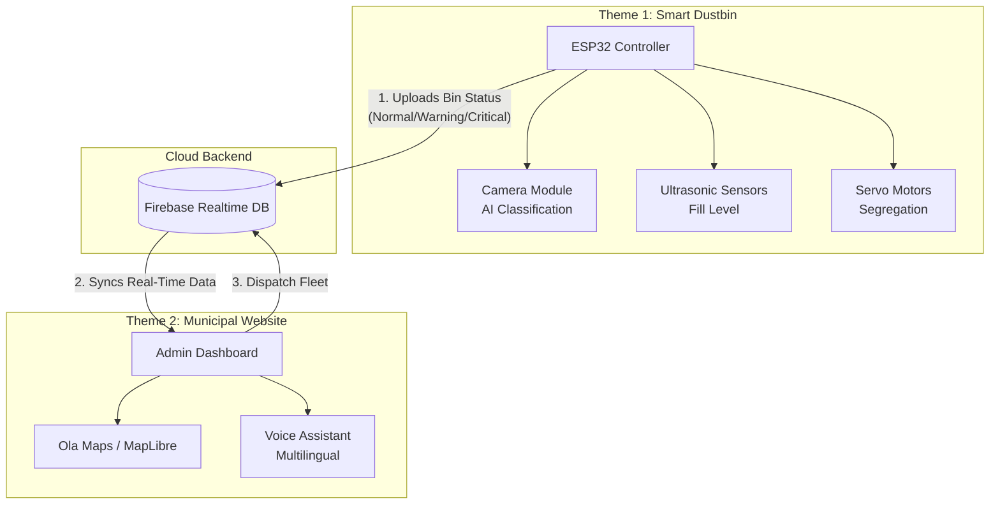
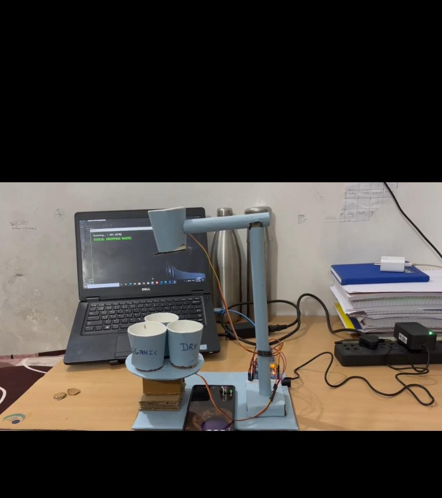
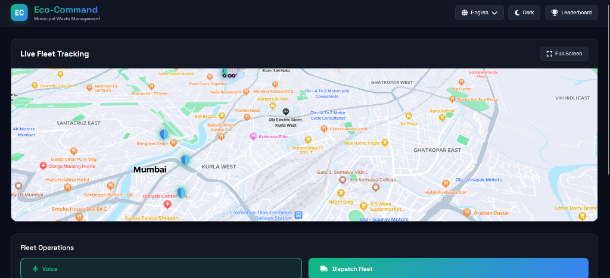
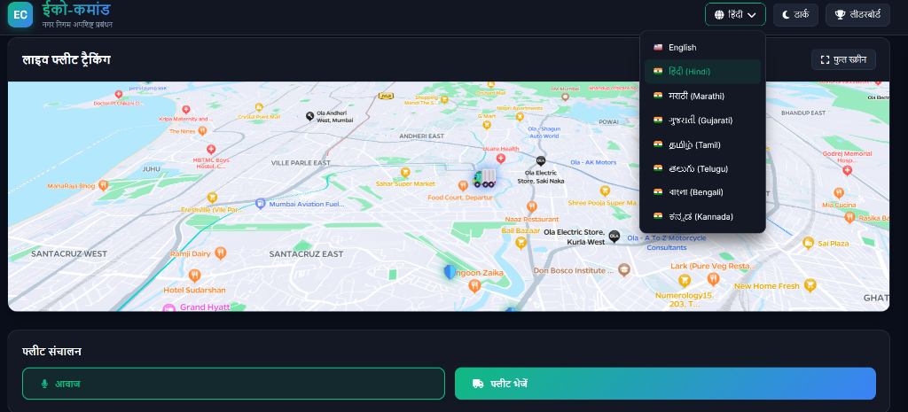

# Eco-Command | Municipal Waste Management System

**Eco-Command** is a smart, IoT-enabled dashboard for monitoring and managing municipal waste collection. It provides real-time tracking of waste collection fleets, monitors smart bin fill levels, and offers a multilingual interface for diverse municipal teams.

## 🚧 Problem Statement

Rapid urbanization has led to inefficient waste management systems characterized by:
*   **Overflowing Bins**: Leading to health hazards and poor sanitation.
*   **Inefficient Routing**: Collection trucks follow fixed routes regardless of bin fill levels, ensuring fuel and time wastage.
*   **Lack of Visibility**: Authorities have no real-time tracking of where trucks are or which bins are missed.
*   **Communication Gaps**: Language barriers between drivers and control centers often lead to operational delays.

## 🎯 Gaps We Covered

This project bridges key gaps in traditional waste management:
*   **Live Monitoring vs. Static Schedules**: Transitioned from fixed daily pickups to dynamic, data-driven dispatching based on real-time bin status.
*   **Predictive Operations**: Sensors alert the system *before* overflow occurs ("Warning" state), allowing proactive collection.
*   **Inclusive Technology**: Added **Multilingual Voice & UI Support** (8 Indian languages) so drivers of all linguistic backgrounds can use the system effectively.
*   **Gamification**: Introduced a **Leaderboard** to motivate drivers and track performance, addressing the lack of incentives in the sector.

## 🏗️ Architecture Design

The system connects IoT hardware (Smart Bins) with a Cloud Backend and a User-Facing Application Layer.



---

# 🤖 Theme 1: Smart Dustbin (AI Segregation)

An intelligent waste scanning and sorting unit that automates segregation at the source.

### ⚙️ How It Works
1.  **AI Scanning**: A camera scans the waste item held in front of it.
2.  **Object Detection**: The system uses a trained AI model (TensorFlow/Keras) to classify the waste as **Organic**, **Dry**, or **Plastic**.
3.  **Automatic Sorting**: Servos actuate a ramp and lid mechanism to drop the waste into the correct underlying compartment.

### 📸 Prototype Model


### 🛠️ Hardware & Tech
*   **ESP32 / Arduino**: For controlling servos and sensors.
*   **Ultrasonic Sensors**: To measure fill levels of the individual compartments.
*   **Python (OpenCV + TensorFlow)**: For real-time image recognition and classification.
*   **Servo Motors**: For the physical segregation mechanism.

---

# 🏙️ Theme 2: Municipal Website (Admin Dashboard)

The central command hub for monitoring bin fill levels (automatically detected by sensors) and managing fleet operations.

### 💻 User Interface

#### 1. Global Command Dashboard
A centralized view for monitoring all trucks, route efficiency, and real-time alerts.


#### 2. Inclusive Multilingual Support
To empower local drivers, the entire interface (including voice navigation) can be instantly toggled between **8 Indian languages** (Hindi, Marathi, Gujarati, etc.).


#### 3. 🎙️ Voice Command System
The system features an integrated **Voice Assistant** that commands, confirms, and alerts:
*   **Alerts**: "Bin 4 is Critical"
*   **Confirmation**: "Dispatching Fleet to Andheri East"
*   **Control**: Toggles themes or languages via voice.

### 🌟 Key Features
*   **📍 Live Fleet Tracking**: Real-time visualization using Ola Maps & MapLibre GL.
*   **🗑️ Bin Monitoring Dashboard**: Live status (Normal/Warning/Critical) of all city bins.
*   **🌓 Dark/Light Mode**: Optimized for all-day usage.
*   **🏆 Leaderboard**: Gamification to reward top-performing drivers.

---

## 🛠️ Global Tech Stack

*   **Frontend**: HTML5, CSS3, JavaScript (ES6+)
*   **Maps**: [Ola Maps API](https://maps.olacabs.com/), [MapLibre GL JS](https://maplibre.org/)
*   **Backend / Database**: [Firebase Realtime Database](https://firebase.google.com/)
*   **AI/ML**: TensorFlow, Keras, OpenCV
*   **Firmware**: Arduino C++

## 📂 Project Structure

```
├── Municipal Party Website   # Main Admin Dashboard & Bin Monitoring
│   ├── index.html
│   ├── style.css
│   ├── script.js
│   └── smart_bin_code.ino
├── Waste distribution Codes  # AI Segregation Logic (Python + Arduino)
├── assets                    # Images and Diagrams
└── README.md                 # Project documentation
```

## 🚀 Getting Started

1.  **Clone the Repo**: `git clone https://github.com/Shreyash-coder40/MUNICIPAL_PARTY_WASTE_SEGREGATION_WEBSITE.git`
2.  **Web Dashboard**: Open `Municipal Party Website/index.html`.
3.  **Smart Bin**: Upload the `.ino` code to your ESP32 and run `main.py` for the AI vision system.
